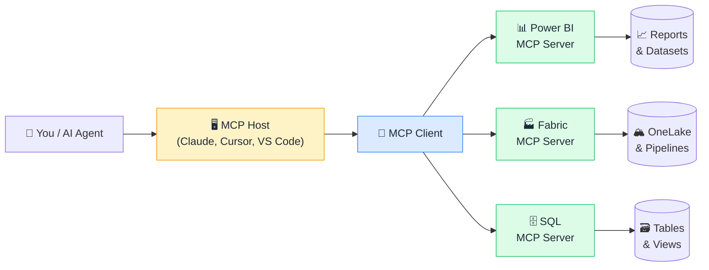

# 🔌 MCP for Data Professionals (Visual Edition)

### Connect AI to your data stack, in minutes, not months.

**Simple visuals + everyday analogies that explain MCP to everyone: whether you're a Power BI developer, a data engineer, or just curious how AI connects to real data.**

*If this helps you finally connect AI to your data, drop a ⭐. It helps more people find it.*

---

## 🤔 Why this exists

AI models are powerful, but they're blind to your data. MCP (Model Context Protocol) is the open standard that fixes that: it lets AI read your databases, query your Power BI datasets, run notebooks in Fabric, and take actions in your data tools, safely and without custom glue code.

The problem: MCP docs are written for AI engineers, not data professionals. This repo sits in the middle. Every concept gets:

- 🧒 **An "Explain Like I'm 5" analogy**: the one-liner you'll actually remember
- 🖼️ **A simple diagram**: see how it connects, don't just read it
- 🔧 **"How it actually works"**: for when you're ready to go deeper
- 🌍 **A real-world example**: where it actually helps in a data context

No AI engineering background required. No prior protocol experience needed. Just curiosity.

---

## 📚 The Concepts

### 🌱 Start here: what is MCP

| # | Concept | One-liner |
|---|---------|-----------|
| 1 | [🔌 What is MCP](data/what-is-mcp.md) | The USB-C standard for connecting AI to tools and data. |
| 2 | [🏗️ MCP Architecture](data/mcp-architecture.md) | Host, Client, Server: three roles, one protocol. |
| 3 | [🌐 MCP vs API](data/mcp-vs-api.md) | When the old way still works and when MCP is better. |

### 🧱 MCP building blocks

| # | Concept | One-liner |
|---|---------|-----------|
| 4 | [📂 Resources](data/resources.md) | Data the AI can read: files, tables, live feeds. |
| 5 | [🛠️ Tools](data/tools.md) | Actions the AI can take: queries, writes, API calls. |
| 6 | [💬 Prompts](data/prompts.md) | Reusable prompt templates the AI can discover and invoke. |
| 7 | [🌳 Roots](data/roots.md) | How the server tells AI which directories it can access. |
| 8 | [🎲 Sampling](data/sampling.md) | Letting the MCP server ask the AI to generate something mid-task. |

### 📊 MCP for your data stack

| # | Concept | One-liner |
|---|---------|-----------|
| 9 | [📊 MCP + Power BI](data/mcp-power-bi.md) | Let AI read your reports, datasets, and run DAX queries. |
| 10 | [🏭 MCP + Microsoft Fabric](data/mcp-fabric.md) | AI on your lakehouse, warehouse, and pipelines. |
| 11 | [🗄️ MCP + SQL Databases](data/mcp-sql.md) | Query any database with natural language. |
| 12 | [📋 MCP + Excel](data/mcp-excel.md) | AI that can read and update your spreadsheets. |
| 13 | [🐍 MCP + Python / Pandas](data/mcp-python.md) | Connect AI to your data science environment. |

### 🔨 Build & secure

| # | Concept | One-liner |
|---|---------|-----------|
| 14 | [🔨 Building Your First MCP Server](data/building-mcp-server.md) | The minimum viable server in under 50 lines. |
| 15 | [🔐 MCP Security](data/mcp-security.md) | What to expose, what to protect, how auth works. |
| 16 | [🔍 MCP Inspector](data/mcp-inspector.md) | The debugging tool every MCP developer needs. |

---

## 🗺️ How it all fits together

> **New to MCP?** Start with [What is MCP](data/what-is-mcp.md), then [MCP Architecture](data/mcp-architecture.md). Then jump to whichever data tool you use most.

---

## 🚀 Quick Start

1. Pick a concept from the table above.
2. Read the analogy. Look at the diagram.
3. Curious? Read "How it actually works."
4. Found it useful? **Star the repo** ⭐ and share it.

---

## 🧩 Sister projects

Part of the **Visual Edition** series:

- 🏭 **[Microsoft Fabric (Visual Edition)](https://github.com/behnia137/microsoft-fabric-visual)**: OneLake, Lakehouses, DirectLake, and more
- 📊 **[DAX (Visual Edition)](https://github.com/behnia137/dax-visual)**: Filter context, CALCULATE, time intelligence
- 🗂️ **[Power BI Data Modeling (Visual Edition)](https://github.com/behnia137/power-bi-data-modeling-visual)**: Star schemas, relationships, performance
- 🧠 **[AI for Beginners (Visual Edition)](https://github.com/behnia137/ai-for-beginners-visual)**: LLMs, RAG, embeddings, and more

---

## 🤝 Contributing

Know an MCP server we're missing? Have a better analogy? **We'd love your help.**

See [CONTRIBUTING.md](CONTRIBUTING.md), adding a concept takes about 10 minutes.

Good first additions: *MCP + Databricks, MCP + Snowflake, MCP + dbt, MCP + Azure Data Factory, MCP transport types (stdio vs SSE), MCP logging, MCP with LangChain, MCP with Semantic Kernel.*

---

## 📜 License

[MIT](LICENSE): free to use, share, remix, and teach with. Attribution appreciated.

---

**Made for data professionals who want AI that actually knows their data.** 🔌

If this made MCP click for you, the best thank-you is a ⭐.

