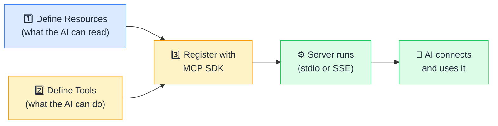

# 🔨 Building Your First MCP Server

> **🧒 Explain Like I'm 5:** An MCP server is just a program that answers three questions: "what data can I read?" (Resources), "what actions can I take?" (Tools), and "what prompt templates do I have?" (Prompts).

## 🖼️ The Picture



```python
# A minimal Power BI MCP server — under 50 lines
from mcp.server.fastmcp import FastMCP
import requests, os

mcp = FastMCP("power-bi-server")

FABRIC_TOKEN = os.environ["FABRIC_TOKEN"]
BASE_URL = "https://api.powerbi.com/v1.0/myorg"

@mcp.tool()
def list_datasets(workspace_id: str) -> list[dict]:
    """List all Power BI datasets in a workspace."""
    url = f"{BASE_URL}/groups/{workspace_id}/datasets"
    resp = requests.get(url, headers={"Authorization": f"Bearer {FABRIC_TOKEN}"})
    resp.raise_for_status()
    return resp.json()["value"]

@mcp.tool()
def refresh_dataset(workspace_id: str, dataset_id: str) -> str:
    """Trigger a refresh for a Power BI dataset."""
    url = f"{BASE_URL}/groups/{workspace_id}/datasets/{dataset_id}/refreshes"
    resp = requests.post(url, headers={"Authorization": f"Bearer {FABRIC_TOKEN}"})
    resp.raise_for_status()
    return f"Refresh triggered for dataset {dataset_id}"

if __name__ == "__main__":
    mcp.run()  # stdio transport by default
```

You write the business logic. The SDK handles JSON-RPC, capability negotiation, and transport.

## 🔧 How it actually works

The MCP SDK — available in **Python** (`mcp` package with `FastMCP`), **TypeScript** (`@modelcontextprotocol/sdk`), and other languages — handles all protocol concerns. You write the logic that matters: what data to fetch, what action to perform. The SDK handles JSON-RPC message framing, the capability handshake (advertising your tools and resources to the client), input schema validation, and transport (stdio for local servers, SSE for remote ones).

Using `FastMCP` in Python, a tool is just a decorated function. The function's **docstring** becomes the tool's description — what the AI reads to decide when to use it. The function's **type-annotated parameters** are automatically converted to a JSON Schema — what the AI uses to construct valid calls. The function's **return value** is serialized and sent back to the AI. That's it. No protocol boilerplate, no message loop, no JSON wrangling.

The most common pattern for data tools is: wrap an existing API or database connection in one or more functions, decorate them with `@mcp.tool()`, and add clear docstrings. A complete SQL query server against a PostgreSQL database (connect, expose schema as a resource, execute read-only queries as a tool) fits in under 50 lines. A Power BI server wrapping the REST API for listing workspaces, datasets, and triggering refreshes is similarly compact.

## 🌍 Real-world example

A Power BI developer wants Claude to be able to refresh any dataset on command. They write a Python MCP server with two tools: `list_datasets(workspace_id)` and `refresh_dataset(workspace_id, dataset_id)`. The server authenticates using a service principal token stored as an environment variable — the AI never sees the credential. Registered in Claude Desktop's config file as a local stdio server, any conversation can now include "refresh the Sales dataset in workspace XYZ" as a natural-language instruction that Claude carries out autonomously.

## 🔗 Related

- [🛠️ Tools](tools.md)
- [📂 Resources](resources.md)
- [🔐 MCP Security](mcp-security.md)
- [🔍 MCP Inspector](mcp-inspector.md)
