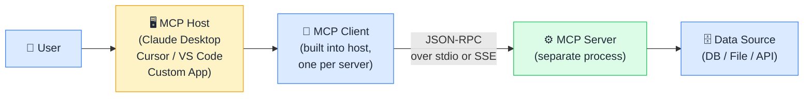

# 🏗️ MCP Architecture

> **🧒 Explain Like I'm 5:** Three roles — the app you're using (Host), the translator inside it (Client), and the specialist it calls (Server). You talk to the Host, the Client handles protocol, the Server knows the data.

## 🖼️ The Picture

The Client lives inside the Host and speaks the MCP protocol; the Server is a separate process that knows how to talk to your actual data.

## 🔧 How it actually works

**The Host** is the application running the AI — Claude Desktop, Cursor, VS Code with a Copilot extension, or any app you build yourself. A single host can contain multiple clients, each connected to a different MCP server simultaneously. The host manages the overall user experience and decides which tools the AI is permitted to use.

**The Client** is a protocol handler built into the host — one client per server connection. It manages the MCP handshake (capability negotiation), sends requests to the server, and translates responses back to the host. Clients are stateful: they maintain an active connection to their server for the lifetime of the session.

**The Server** is a lightweight, separate process that exposes your data or tools over the MCP protocol. It speaks JSON-RPC — a simple request/response format over either `stdio` (for local servers, fastest and most private) or Server-Sent Events over HTTP (SSE, for remote servers accessible across a network). The server holds your credentials and handles all communication with the underlying data source — the AI never touches your passwords or API keys directly.

## 🌍 Real-world example

When you use Claude Desktop with a SQL MCP server installed, Claude Desktop is the Host. At startup it spawns a Client that connects to the SQL server process via stdio. When you ask "how many orders shipped last week?", the Client sends a `tools/call` request to the SQL server, which translates your natural-language question into SQL, queries the database, and returns the result — all without Claude ever holding a database connection string.

## 🔗 Related

- [🔌 What is MCP](what-is-mcp.md)
- [🛠️ Tools](tools.md)
- [📂 Resources](resources.md)
- [🔐 MCP Security](mcp-security.md)
