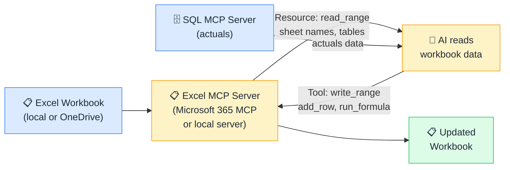

# 📋 MCP + Excel

> **🧒 Explain Like I'm 5:** Instead of copy-pasting data into prompts, you point the AI at the spreadsheet and it reads it directly, then updates it when you ask.

## 🖼️ The Picture

The AI reads budget assumptions from Excel, queries actuals from another MCP server, calculates variances, and writes the results back, a complete automated variance analysis without VBA.

## 🔧 How it actually works

Excel MCP servers (such as the Microsoft 365 MCP server or community servers wrapping the Excel JavaScript API) expose workbook structure as **Resources** and editing operations as **Tools**. Common Resources: sheet names, named ranges, table definitions, and range values. Common Tools: `read_range` (read cell values from a specified range), `write_range` (write values into cells), `add_row` (append a row to a table), `run_formula` (evaluate a formula and return the result).

What makes Excel MCP genuinely powerful is **cross-server composition**. Because MCP clients can connect to multiple servers simultaneously, the AI can read an Excel planning model via one server and query a SQL database or Power BI dataset via a second server, then write the comparison back into the Excel file. This pattern (read assumptions from Excel, query actuals from the data warehouse, compute variance, write back) replaces complex VBA macros or manual copy-paste workflows with a simple natural-language instruction.

For finance teams, this is particularly transformative for budget-vs-actual reporting, scenario planning, and management report preparation, tasks that traditionally involve significant manual spreadsheet work.

## 🌍 Real-world example

A finance team has a budget Excel file on SharePoint with budgeted sales by region. An analyst asks Claude to "compare budgeted vs actual sales by region and flag anything over 10% variance." Claude reads the budget ranges from Excel via the Microsoft 365 MCP server, queries actual sales totals from the SQL data warehouse via a second MCP server, calculates the variance percentage for each region, and writes the flagged rows (those exceeding 10%) back into a new "Variance Analysis" sheet in the same Excel file, complete with conditional formatting values, autonomously, in under a minute.

## 🔗 Related

- [📊 MCP + Power BI](mcp-power-bi.md)
- [🗄️ MCP + SQL Databases](mcp-sql.md)
- [🛠️ Tools](tools.md)
