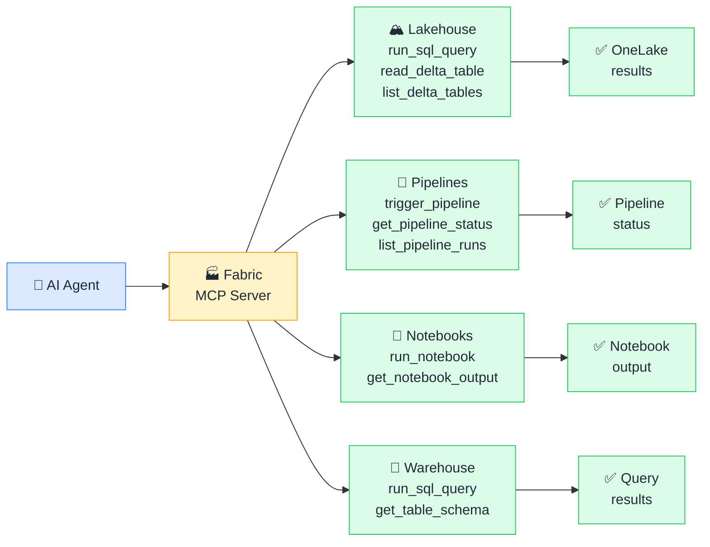

# 🏭 MCP + Microsoft Fabric

> **🧒 Explain Like I'm 5:** Instead of writing notebooks and pipelines yourself, you describe what you want and AI runs the Spark jobs, queries the lakehouse, and monitors the pipeline for you.

## 🖼️ The Picture

One Fabric MCP server reaches lakehouses, warehouses, pipelines, and notebooks through a single authenticated connection, because everything lives in OneLake.

## 🔧 How it actually works

A Fabric MCP server exposes Microsoft Fabric's REST API and SQL analytics endpoints as MCP tools. Fabric's unified architecture makes this particularly powerful: because all data lives in **OneLake** and all compute (Spark, SQL, notebooks) operates on the same underlying storage, one MCP server can reach every Fabric workload through a single service principal or user-delegated credential.

Typical **Tools**: `list_workspaces`, `list_lakehouses`, `list_delta_tables` (enumerate all Delta tables in a lakehouse), `run_sql_query` (execute T-SQL against the lakehouse SQL analytics endpoint or Warehouse), `trigger_pipeline`, `get_pipeline_status`, `list_pipeline_runs`, `run_notebook` (trigger a Spark notebook with optional parameters), `get_notebook_output`. Typical **Resources**: workspace item inventory (as JSON), Delta table schema and sample rows, pipeline run history.

Because Fabric unifies data engineering, data warehousing, and data science under one platform, an AI with a Fabric MCP server can orchestrate genuine end-to-end data workflows: load raw files into Bronze, run a transformation notebook to produce Silver, execute a SQL validation against the Warehouse, and refresh the downstream Power BI semantic model, all in a single conversation.

## 🌍 Real-world example

A data engineer asks Claude "did last night's ingestion pipeline complete successfully and are the row counts in the silver lakehouse consistent with the source system?" The Fabric MCP server checks the pipeline run status (`get_pipeline_status`), queries the silver lakehouse table for its row count (`run_sql_query`), and queries the source system row count via a second SQL MCP server. The AI compares the numbers, confirms they match within tolerance, and flags one table that is 12% short, a task that previously required navigating three different monitoring screens, running two queries manually, and cross-referencing the results in a spreadsheet.

## 🔗 Related

- [📊 MCP + Power BI](mcp-power-bi.md)
- [🗄️ MCP + SQL Databases](mcp-sql.md)
- [🛠️ Tools](tools.md)
