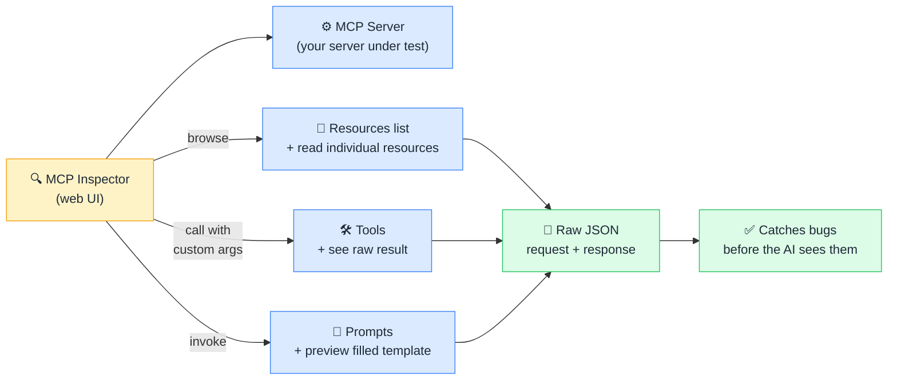

# 🔍 MCP Inspector

> **🧒 Explain Like I'm 5:** MCP Inspector is the browser DevTools for MCP — open it, send test requests to your server, and see exactly what the AI would receive.

## 🖼️ The Picture

MCP Inspector connects directly to your server and exposes every resource, tool, and prompt interactively — showing the raw JSON so you see exactly what the AI would receive.

## 🔧 How it actually works

MCP Inspector is an official debugging tool from Anthropic, available as an npm package (`@modelcontextprotocol/inspector`). It's a web-based UI that connects directly to any MCP server — local or remote — and provides a complete interactive view of everything that server exposes.

In the Inspector UI you can: browse the full **Resources list** and request any individual resource to see its current content; call any **Tool** with custom argument values and see the exact response (or error) the AI would receive; and invoke any **Prompt** with arguments to preview the fully assembled prompt template. Every interaction shows the raw JSON-RPC request and response side by side — the same bytes the AI would see over the wire.

This is invaluable during development. Common issues it catches immediately: a tool returning data in an unexpected format (the AI would misinterpret it), a resource URI that resolves to nothing (the AI would report that data doesn't exist), a tool description that's too vague (the AI might not know when to call it), or an authentication error on first connection (fix the credential before wasting time debugging through a full AI session).

Launch it with `npx @modelcontextprotocol/inspector` followed by the command to start your server. The Inspector handles the connection and presents the UI in your browser at `localhost:5173`.

## 🌍 Real-world example

A developer builds a Power BI MCP server and wires up a `run_dax_query` tool that accepts `dataset_id` and `dax_expression` parameters. Before connecting it to Claude Desktop, they open MCP Inspector and call `run_dax_query` with a test dataset ID and a simple `EVALUATE ROW("test", 1)` expression. The Inspector immediately shows a `401 Unauthorized` error in the raw JSON response — the Bearer token in the server's environment variable has expired. Fixed in two minutes by rotating the token. Without Inspector, this would surface as confusing AI behavior ("I couldn't find that dataset") requiring several minutes of back-and-forth to diagnose.

## 🔗 Related

- [🔨 Building Your First MCP Server](building-mcp-server.md)
- [🛠️ Tools](tools.md)
- [📂 Resources](resources.md)
- [🏗️ MCP Architecture](mcp-architecture.md)
