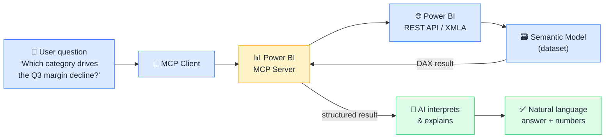

# 📊 MCP + Power BI

> **🧒 Explain Like I'm 5:** Imagine asking a question in plain English and having AI query your Power BI dataset, run the right DAX measure, and explain the result, without you touching a single formula.

## 🖼️ The Picture

The MCP server wraps the Power BI REST API and XMLA endpoint; the AI explores the semantic model and writes DAX at runtime to answer any question.

## 🔧 How it actually works

A Power BI MCP server wraps two Microsoft APIs: the **Power BI REST API** (for workspace, dataset, and report metadata) and the **XMLA endpoint** (for executing DAX queries against published semantic models). These are exposed as MCP Tools and Resources that any MCP-compatible AI host can use.

Common **Tools**: `list_workspaces`, `list_datasets`, `get_dataset_schema` (tables, columns, relationships, measures), `run_dax_query` (execute arbitrary DAX and return results), `get_report_pages`, `refresh_dataset`. Common **Resources**: report page thumbnails (as images), dataset metadata (as JSON), existing measure definitions (as DAX text).

The key capability is `get_dataset_schema` followed by `run_dax_query`. The AI first reads the full model structure (every table, column, relationship, and measure) and then writes targeted DAX to answer the user's question. Because it reads the live schema at query time, it adapts automatically when the model changes. No pre-built report or pre-written measure is required for the AI to answer analytical questions.

## 🌍 Real-world example

A sales analyst asks Claude "which product category is driving the decline in Q3 margin?" The Power BI MCP server exposes the semantic model schema. The AI discovers that `FactSales` has `[Margin %]` and `[Category]` fields and that a date table with a `[Fiscal Quarter]` column exists. It writes a `CALCULATE` expression with `SAMEPERIODLASTYEAR` to compute YoY margin by category, executes it via `run_dax_query`, and explains in plain English that "Outdoor Equipment margins fell 4.2 percentage points YoY, driven by rising input costs," without the analyst writing a single line of DAX or building a new report page.

## 🔗 Related

- [🏭 MCP + Microsoft Fabric](mcp-fabric.md)
- [🗄️ MCP + SQL Databases](mcp-sql.md)
- [🛠️ Tools](tools.md)
- [📂 Resources](resources.md)
