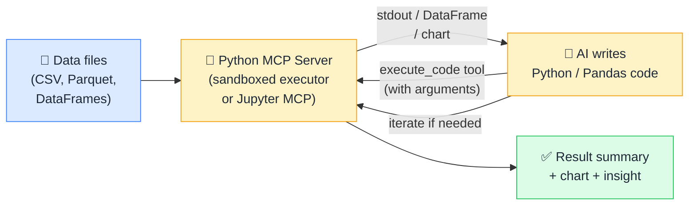

# 🐍 MCP + Python / Pandas

> **🧒 Explain Like I'm 5:** Give the AI a Python interpreter and a pile of data: it writes and runs the analysis code itself, then explains what it found.

## 🖼️ The Picture

The AI writes code, runs it in a sandbox, reads the output, and iterates, turning a data file into insight through a natural-language conversation.

## 🔧 How it actually works

Python MCP servers (such as sandboxed Python executors, Jupyter MCP, or custom servers wrapping an IPython kernel) expose code execution as a **Tool** and analysis outputs as **Resources**. The core tool is `execute_code`: the AI passes a Python code string, the server runs it in an isolated sandbox, and returns `stdout`, error messages, and any serialized outputs (DataFrames as JSON, charts as base64 images, or file paths). Resources include the file system within the sandbox (declared via Roots), any DataFrames persisted between executions, and notebook cell outputs.

The AI writes code iteratively. If a first attempt produces an error, the server returns the traceback and the AI fixes the code and retries, exactly as a human programmer would. Because the sandbox is isolated, the AI can only access files within the declared roots and cannot reach external systems unless the server explicitly provides those connections. This sandboxing makes Python MCP servers safe for analyst-facing deployments even when the AI has full code execution capability.

For data science work this is transformative: instead of writing exploratory analysis yourself, you describe what you want to understand. The AI writes Pandas, Polars, Matplotlib, or scikit-learn code, executes it, interprets the results, and suggests the next analytical step. The iteration loop (write → run → interpret → refine) happens inside the MCP protocol, invisibly to the user.

## 🌍 Real-world example

A data scientist has a CSV of customer transaction data and asks Claude "find any unusual spending patterns in this dataset." Claude writes Pandas code to load the file, compute per-customer total spend and transaction frequency statistics, identify outliers using the interquartile range (IQR) method, and plot the top 10 anomalies as a scatter chart. It executes the code via the `execute_code` tool, receives the chart image and the outlier DataFrame, and explains in plain English that "12 customers show spend volumes more than 3 standard deviations above the mean, concentrated in the Electronics category, potentially high-value customers or unusual activity worth reviewing."

## 🔗 Related

- [🗄️ MCP + SQL Databases](mcp-sql.md)
- [🏭 MCP + Microsoft Fabric](mcp-fabric.md)
- [🛠️ Tools](tools.md)
- [🔐 MCP Security](mcp-security.md)
