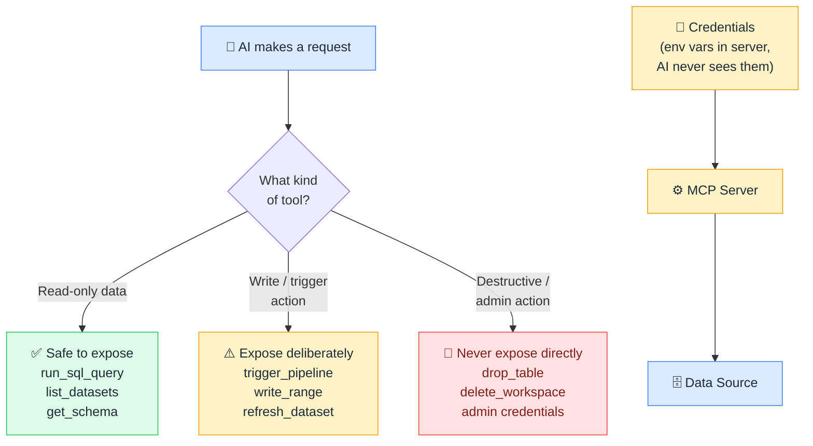

# 🔐 MCP Security

> **🧒 Explain Like I'm 5:** Give the AI a flashlight, not a master key. Expose only what it needs: read-only unless write access is genuinely required.

## 🖼️ The Picture

Credentials stay in the server as environment variables; the AI authenticates through the server, never holding passwords or tokens directly.

## 🔧 How it actually works

MCP servers sit between the AI and your data, which gives you a clean place to enforce security policy. The AI never holds your database password or API key; the server authenticates to the data source itself, using credentials stored as environment variables, and only returns what the AI explicitly requested.

Five principles for secure MCP deployments:

**(1) Least privilege.** Only expose the tools the AI actually needs for its purpose. A reporting AI doesn't need a `delete_table` tool. A scheduling AI doesn't need `run_arbitrary_sql`. Define the minimum surface area and stick to it.

**(2) Read-only by default.** Write-capable tools (`write_range`, `trigger_pipeline`, `run_notebook`) should be deliberate additions, not defaults. Start with a read-only server, add write tools only when there's a clear need.

**(3) Credentials stay in the server.** Configure database connection strings, API keys, and service principal secrets as environment variables in the server process. Never pass them through tool arguments, system prompts, or MCP messages: they could be logged or leaked.

**(4) Human-in-the-loop for destructive actions.** Triggering a pipeline refresh is lower risk than dropping a table. For high-consequence tools, consider requiring a confirmation step: either an explicit user approval in the host UI, or a two-step tool pattern where the AI proposes an action and a separate `confirm_action` tool executes it.

**(5) Audit every tool invocation.** MCP servers should log every `tools/call` request: which tool, what arguments, what result, at what timestamp, for which session. This creates an audit trail for compliance and helps diagnose unexpected AI behavior.

## 🌍 Real-world example

A data team deploys a Fabric MCP server for their analysts. They expose three read-only tools: `list_tables`, `run_sql_query` (read-only, `SELECT` only), and `get_pipeline_status`. Write-capable tools (`trigger_pipeline`, `run_notebook`) are only available in a separate "ops" server that requires a different service principal with narrower role assignments. Analysts get full exploratory power; only the on-call data engineer can trigger production changes, enforced by the server configuration, not by trusting the AI to self-restrain.

## 🔗 Related

- [🔨 Building Your First MCP Server](building-mcp-server.md)
- [🛠️ Tools](tools.md)
- [🏗️ MCP Architecture](mcp-architecture.md)
