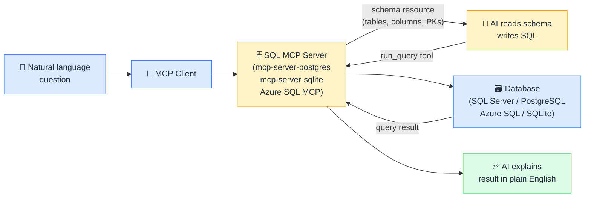

# 🗄️ MCP + SQL Databases

> **🧒 Explain Like I'm 5:** Ask your database a question in English. The AI figures out the SQL, runs it, and explains the answer.

## 🖼️ The Picture

The AI reads the live database schema as a Resource, writes targeted SQL, executes it as a Tool call, and interprets the result — zero SQL from the user required.

## 🔧 How it actually works

SQL MCP servers (such as `mcp-server-sqlite`, `mcp-server-postgres`, and the Azure SQL MCP server from Microsoft) expose two main capabilities: **schema as a Resource** and **query execution as a Tool**.

The AI first calls the schema resource to understand the database structure — table names, column names and data types, primary and foreign key relationships, and any view definitions. Because the schema is read from the live database at query time, it reflects the current state of the database automatically. No manual documentation upkeep, no stale ERD files. The AI then writes a SQL query tailored to the user's question and executes it using the `run_query` tool, receiving the result set as structured data it can summarize, aggregate further, or present as a table.

Most SQL MCP servers are **read-only by default** for safety: `SELECT` statements only, no `INSERT`, `UPDATE`, `DELETE`, or DDL. Write access is a deliberate configuration choice that should be made consciously. This default makes SQL MCP servers safe to deploy for business analysts and reporting users who should explore data but never modify it.

## 🌍 Real-world example

A business analyst with no SQL knowledge asks "how many orders were placed in each region last month, ranked by revenue?" The SQL MCP server exposes the schema, the AI discovers a `Orders` table with `region`, `order_date`, and `revenue` columns, writes a `GROUP BY region ... ORDER BY SUM(revenue) DESC` query filtered to the prior calendar month, executes it, and returns a ranked table with region names and totals — zero SQL written by the user, zero report built in advance.

## 🔗 Related

- [📊 MCP + Power BI](mcp-power-bi.md)
- [🏭 MCP + Microsoft Fabric](mcp-fabric.md)
- [🔐 MCP Security](mcp-security.md)
- [🛠️ Tools](tools.md)
