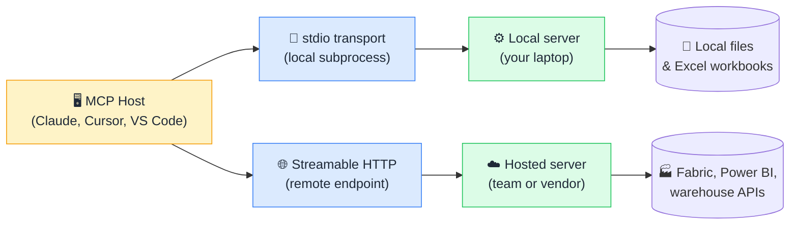

# 🚚 MCP Transports

> **🧒 Explain Like I'm 5:** A transport is the pipe the AI and the server talk through: either they sit at the same desk and pass notes (stdio), or they phone each other across the internet (HTTP).

## 🖼️ The Picture

Same protocol, same messages, two different pipes: one local, one over the network.

## 🔧 How it actually works

MCP always speaks JSON-RPC 2.0. The transport is simply how those JSON-RPC messages travel. With **stdio**, the host launches the server as a child process and writes requests to its standard input, reading responses from its standard output (one JSON message per line). There is no port, no URL, and no network hop, which is why stdio is the default for anything running on your own machine. One important rule: a stdio server must never print stray text to stdout, because anything that is not a valid JSON-RPC message corrupts the stream. Logs go to stderr instead.

With **Streamable HTTP**, the server lives behind a URL and the host sends requests as HTTP POSTs. The server can answer with a plain JSON response, or upgrade the reply to a Server-Sent Events stream when it needs to push progress updates, logs, or several messages over the life of one request. This is the current remote transport in the MCP specification; it replaced the older two-endpoint HTTP+SSE design, which you will still see in some servers written before the change. Most modern SDKs can serve both so older clients keep working.

Choosing between them is mostly a question of where the data lives and who needs access. Local files, a desktop Excel workbook, or a database reachable only from your laptop point to stdio. A server that a whole analytics team shares, or one that needs OAuth and a proper audit trail, points to HTTP. The tools, resources, and prompts your server exposes do not change either way, so you can start with stdio and move to HTTP later without rewriting the logic.

## 🌍 Real-world example

You build a small MCP server that reads local `.pbix` exports and returns table statistics. On your machine it runs over stdio: your editor spawns `python pbix_server.py`, and everything stays on disk. Six months later the finance team wants the same capability against the shared Fabric workspace, so you deploy the same server behind an Azure App Service endpoint with Streamable HTTP and Entra ID authentication. The tool definitions are untouched; only the transport and the auth layer changed.

## 🔗 Related

- [🏗️ MCP Architecture](mcp-architecture.md)
- [🔨 Building Your First MCP Server](building-mcp-server.md)
- [🔐 MCP Security](mcp-security.md)
- [🔍 MCP Inspector](mcp-inspector.md)
