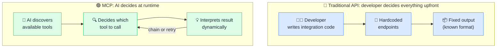

# 🌐 MCP vs API

> **🧒 Explain Like I'm 5:** An API is a vending machine: you press a specific button and get a specific thing. MCP is a sommelier: you describe what you're after and it figures out which button to press.

## 🖼️ The Picture

With a traditional API the developer writes every integration step in advance; with MCP the AI reads what's available at runtime and decides what to do.

## 🔧 How it actually works

APIs require the developer to know in advance exactly what they want to call and how to call it. You write code that calls a specific endpoint, parses a specific response format, and handles specific error codes. This is excellent for predictable, high-volume operations: a scheduled pipeline calling the Power BI refresh API is a perfect API use case.

MCP is designed for AI agents that don't know in advance what they'll need. At connection time, the server advertises its full menu of capabilities: the list of tools, resources, and prompts it offers, each with a description and parameter schema. The AI reads this list, reasons about the user's request, and decides at runtime which tools to call and in what order. It can chain multiple tool calls, pass results from one into the next, and adapt if a step fails. The protocol overhead is higher than a direct API call, but the flexibility is incomparably better for agentic, open-ended tasks.

The practical rule of thumb: **use an API** when a developer is writing deterministic integration code. **Use MCP** when an AI agent needs to explore, decide, and act on behalf of a user, especially when the exact steps aren't known ahead of time.

## 🌍 Real-world example

A traditional Power BI REST API integration requires a developer to write code that calls `GET /datasets`, then `POST /datasets/{id}/executeQueries` with a pre-written DAX query. An MCP Power BI server lets the AI explore what datasets exist, discover what measures are available in the semantic model, and write its own DAX to answer the user's question, without any of that upfront coding, and without a developer anticipating every possible question in advance.

## 🔗 Related

- [🔌 What is MCP](what-is-mcp.md)
- [🛠️ Tools](tools.md)
- [🔐 MCP Security](mcp-security.md)
