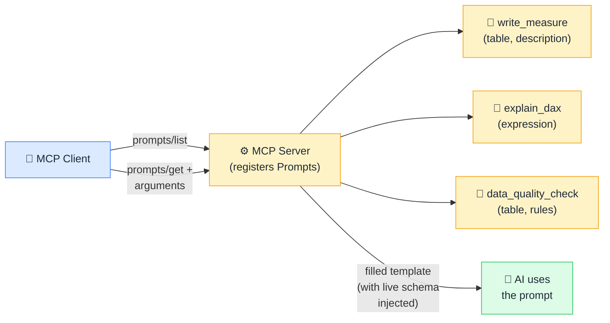

# 💬 Prompts

> **🧒 Explain Like I'm 5:** Prompts in MCP are like macros — reusable templates the AI can discover and fill in, instead of writing from scratch every time.

## 🖼️ The Picture

The server stores prompt templates and can inject live data (like the current schema) before returning them — every team member gets the same context automatically.

## 🔧 How it actually works

MCP **Prompts** are pre-written prompt templates stored on the server. Each prompt has a name, a human-readable description, and optional arguments — like a function with named parameters. When the AI (or a user through the host UI) invokes a prompt, the server receives the arguments, dynamically assembles the full prompt text — potentially injecting live data such as the current database schema, active report structure, or org-specific style guidelines — and returns the completed prompt for the AI to use.

This is fundamentally different from Resources (which give the AI raw data) and Tools (which make the AI take actions). Prompts **shape how the AI thinks about a task** before it starts. They encode expert knowledge, organizational conventions, and contextual data into a reusable, discoverable package. Instead of users having to manually copy-paste context into every conversation, the MCP server provides it automatically.

For data teams this is especially powerful: you can encode your organization's DAX coding standards, data governance rules, or data model documentation into a server-side prompt. Any analyst using Claude or another MCP host against your server automatically gets that context — consistently, without remembering to include it.

## 🌍 Real-world example

A DAX MCP server might expose a prompt called `write_measure` that accepts a `table` name and a plain-English `description`. When invoked, the server fetches the current data model schema from the Power BI XMLA endpoint, injects it alongside your organization's DAX style guide (variable naming conventions, DIVIDE instead of division, etc.), and returns the complete prompt to the AI. Every analyst writing a new measure gets the full model context and coding standards automatically — and the AI produces consistent, policy-compliant DAX every time.

## 🔗 Related

- [🛠️ Tools](tools.md)
- [📂 Resources](resources.md)
- [🔌 What is MCP](what-is-mcp.md)
