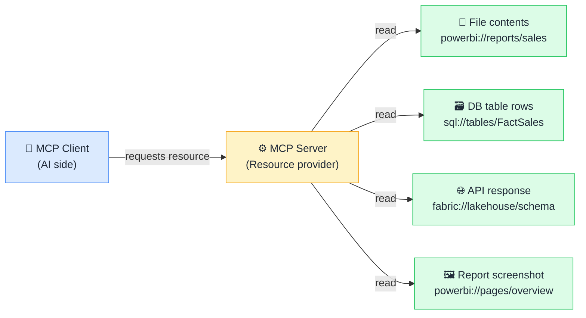

# 📂 Resources

> **🧒 Explain Like I'm 5:** Resources are the things the AI can read — files, database rows, dashboard screenshots. They're read-only: look but don't touch.

## 🖼️ The Picture

The AI requests a resource by URI; the server fetches the latest version and returns it — read-only by design.

## 🔧 How it actually works

In MCP, a **Resource** is any piece of data a server can hand to the AI. Each resource has a URI — a unique address that looks like a web URL but is specific to the server's domain, e.g. `powerbi://datasets/sales/tables/FactSales` or `file:///data/reports/Q3.csv`. Resources can be static (a fixed file) or dynamic (the result of a live database query executed at read time).

The AI requests a resource by sending a `resources/read` call with the URI. The server fetches the latest version and returns the content — text, JSON, binary data, or an image. Resources are **read-only by design**: if the AI needs to modify something, that's a Tool, not a Resource. This separation matters for safety. Exposing your sales data as a resource does not give the AI permission to change it — the exposure is strictly one-directional.

Servers also expose a `resources/list` endpoint so the AI can discover what resources are available before requesting them. Some servers also support **resource subscriptions**: the server notifies the client when a resource's content changes, enabling the AI to react to live data updates without polling.

## 🌍 Real-world example

A Fabric MCP server might expose your lakehouse Delta table as a resource — the AI reads the current schema and a sample of rows to understand the data shape before writing a query. A Power BI MCP server might expose a report page as a resource (as an image or a structured JSON of the visuals) so the AI can describe what it sees, identify anomalies in a chart, or help a user understand what a dashboard is showing — all without the AI ever being able to alter the report.

## 🔗 Related

- [🛠️ Tools](tools.md)
- [💬 Prompts](prompts.md)
- [🏗️ MCP Architecture](mcp-architecture.md)
