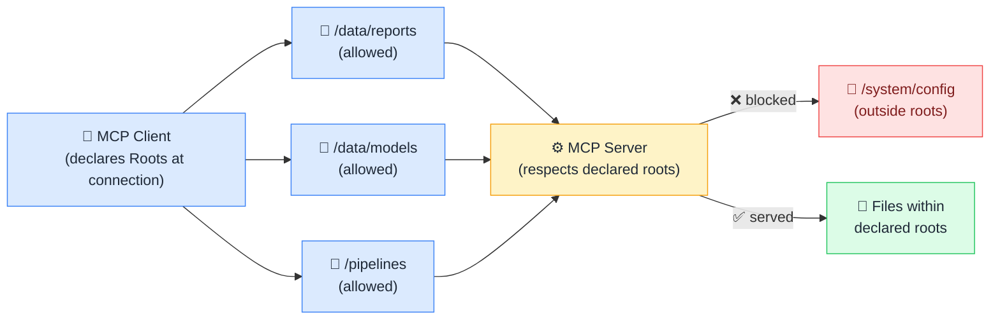

# 🌳 Roots

> **🧒 Explain Like I'm 5:** Roots are the AI's map of where it's allowed to look, like telling a new employee "you can only access files in these three folders."

## 🖼️ The Picture

The client declares which URIs the server is allowed to operate within; anything outside that boundary is off-limits.

## 🔧 How it actually works

Roots are URIs that the MCP client declares to the server at connection time. The client says: "I am working in these directories or on these resources, please scope your behavior accordingly." A typical roots message lists one or more base URIs, e.g. `file:///projects/salesmodel` or `fabric://workspaces/analytics-team`. The server reads this list and restricts its operations to content within those boundaries.

It's important to understand what Roots are and aren't. They are a **scoping signal**: a clear declaration of intent that well-behaved MCP servers respect. They are not a hard cryptographic security boundary enforced by the protocol itself; enforcement depends on the server's implementation. For genuine access control you still need proper authentication and authorization at the data layer. Think of Roots as the polite handshake that says "here's our working scope," not the lock on the door.

In practice, Roots are most useful when you want an AI to work on a specific project without accidentally wandering into adjacent workspaces. A filesystem MCP server honors roots by only listing files under the declared paths. A Fabric MCP server honors roots by only exposing items from the declared workspace. This keeps agentic AI focused and makes it easier to audit what it accessed.

## 🌍 Real-world example

When you open a Power BI project folder in Cursor with an MCP filesystem server configured, the editor declares that project folder as a root: `file:///projects/sales-powerbi`. The AI restricts its file operations to that directory: it reads your `.bim` model file, your DAX files, and your report layout files, but won't wander into adjacent projects' files or system directories. If you later open a second workspace in a split editor, Cursor adds that second path as an additional root.

## 🔗 Related

- [🔐 MCP Security](mcp-security.md)
- [🏗️ MCP Architecture](mcp-architecture.md)
