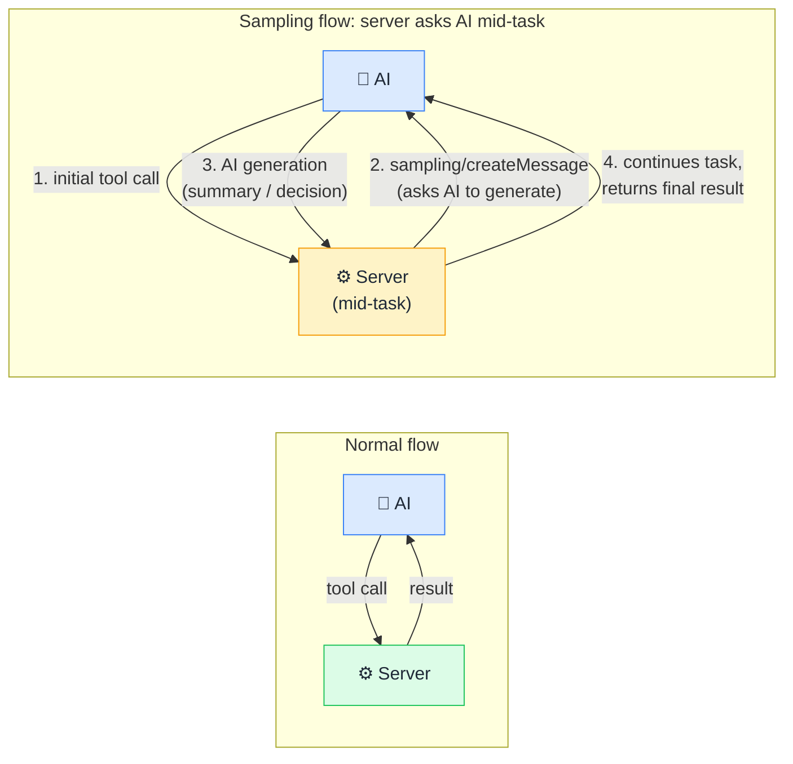

# 🎲 Sampling

> **🧒 Explain Like I'm 5:** Normally the AI calls the server. Sampling flips it: the server asks the AI to generate something mid-task, like asking a colleague for a second opinion halfway through a job.

## 🖼️ The Picture

Sampling creates a feedback loop: the server can pause, consult the AI for a generation, then continue, enabling genuinely agentic multi-step reasoning.

## 🔧 How it actually works

In standard MCP, communication is one-directional from the AI's perspective: the AI sends requests, the server responds. **Sampling** introduces a reverse channel. Using the `sampling/createMessage` request, a server can pause during a tool execution, send a prompt back through the client to the host AI model, receive a generated response, and use that response to continue the task.

This is a significant capability because it lets servers orchestrate complex, reasoning-heavy workflows without the AI needing to know every step upfront. The server collects raw data, formulates a targeted question (e.g. "given these error logs, what is the most likely root cause?"), asks the AI to generate an answer, and incorporates that answer into the final tool result. The AI's generative intelligence becomes a reusable sub-component that server logic can call on demand.

Not all MCP hosts support sampling; it requires the host to declare the `sampling` capability during the initial handshake. The AI model processing the sampling request may be the same model that initiated the original tool call, or a different one. The host controls this and is responsible for any human-in-the-loop approval if required, since sampling can generate content that the server then acts upon.

## 🌍 Real-world example

A Microsoft Fabric pipeline MCP server uses sampling to generate human-readable failure summaries. When the `get_pipeline_run_status` tool is called and detects a failure, the server collects the raw activity error logs (its own data), issues a `sampling/createMessage` request asking the AI to explain the failure in plain English for a non-technical stakeholder, receives the explanation, and bundles it into the tool result alongside the raw logs. The user gets both the technical details and a plain-English summary in one response, without the AI needing to be prompted for the summary separately.

## 🔗 Related

- [🛠️ Tools](tools.md)
- [🏗️ MCP Architecture](mcp-architecture.md)
- [🔌 What is MCP](what-is-mcp.md)
