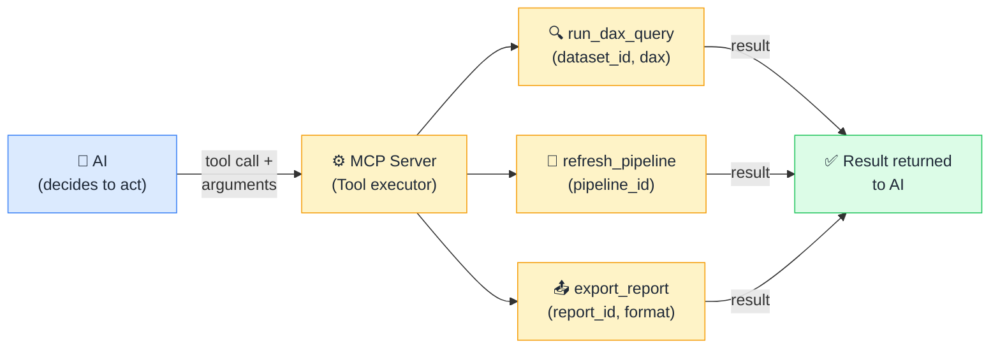

# 🛠️ Tools

> **🧒 Explain Like I'm 5:** Tools are the things the AI can *do*: run a query, send an email, refresh a pipeline. Read AND write.

## 🖼️ The Picture

The AI picks a tool, sends structured arguments, and the server executes, then returns the result for the AI to interpret.

## 🔧 How it actually works

A **Tool** is a function the AI can invoke. Unlike Resources (passive data the AI reads), Tools take action. Each tool has three things: a **name** (e.g. `run_dax_query`), a **description** (plain-English explanation of what it does and when to use it), and a **JSON Schema** defining its parameters (what arguments it accepts, their types, which are required). The AI reads all of this at connection time; it uses the descriptions to decide when each tool is relevant, and the schemas to know exactly how to construct a valid call.

When the AI decides to use a tool, it sends a `tools/call` request: tool name plus a structured JSON object of arguments. The server validates the arguments against the schema, executes the underlying action (runs a SQL query, triggers a REST API, writes to a file), and returns the result as text or structured data. If the action fails, the server returns an error, and the AI can then decide whether to retry, use a different tool, or tell the user what went wrong.

Tools are the "hands" of the AI; Resources are the "eyes." Most safety considerations in MCP revolve around which tools you expose. A read-only `run_dax_query` tool is low risk. A `drop_table` tool is very high risk. Design your tool surface carefully: expose only what the AI genuinely needs for its intended purpose.

## 🌍 Real-world example

A Fabric MCP server with a `run_notebook` tool lets the AI trigger a Spark notebook with specific parameters, for example, kicking off a data quality check against a specific lakehouse table. A Power BI MCP server with a `run_dax_query` tool lets the AI evaluate custom DAX against any published dataset, meaning you can ask "what's the YoY growth for Electronics?" and the AI writes the `CALCULATE([Sales], SAMEPERIODLASTYEAR('Date'[Date]))` expression itself, executes it via the server, and explains the result, no pre-built measure required.

## 🔗 Related

- [📂 Resources](resources.md)
- [💬 Prompts](prompts.md)
- [🔐 MCP Security](mcp-security.md)
