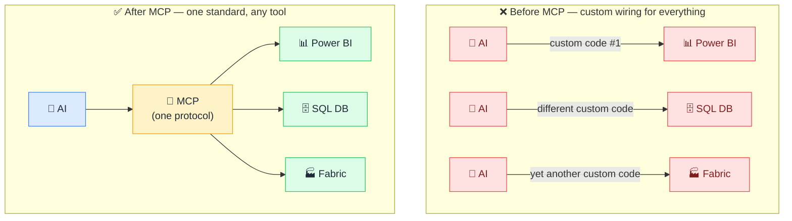

# 🔌 What is MCP

> **🧒 Explain Like I'm 5:** It's the USB-C standard for AI — one plug that lets any AI connect to any tool or data source, without custom wiring for each one.

## 🖼️ The Picture

Before MCP, every AI-to-data integration was a one-off. After MCP, any AI speaks the same language as any compliant server.

## 🔧 How it actually works

MCP (Model Context Protocol) is an open standard created by Anthropic that defines how AI models communicate with external tools, data sources, and services. Before MCP, every integration was custom — a different API, a different format, a different authentication approach for each data tool. MCP standardizes the conversation: every server speaks the same language, and every client knows how to listen.

The protocol defines three things a server can offer: **Resources** (data to read, like database tables or files), **Tools** (actions to take, like running a query or refreshing a pipeline), and **Prompts** (reusable prompt templates the AI can discover and invoke). The AI doesn't need to know which database engine it's talking to or how a specific API works — it just asks the MCP server, and the server handles the rest.

This is why MCP is often called "the USB-C for AI": one standard, infinite devices. You write an MCP server once for your data tool, and any MCP-compatible AI host — Claude Desktop, Cursor, VS Code, or your own application — can immediately use it without any additional integration work.

## 🌍 Real-world example

Claude Desktop uses MCP to connect to your filesystem, your browser, and your calendar. Cursor IDE uses it to let the AI read your codebase. In data work, an MCP server for Power BI means Claude can answer "which report has the highest bounce rate?" without you writing a single line of integration code — the server handles authentication, API calls, and data formatting automatically.

## 🔗 Related

- [🏗️ MCP Architecture](mcp-architecture.md)
- [🛠️ Tools](tools.md)
- [📂 Resources](resources.md)
- [🌐 MCP vs API](mcp-vs-api.md)
